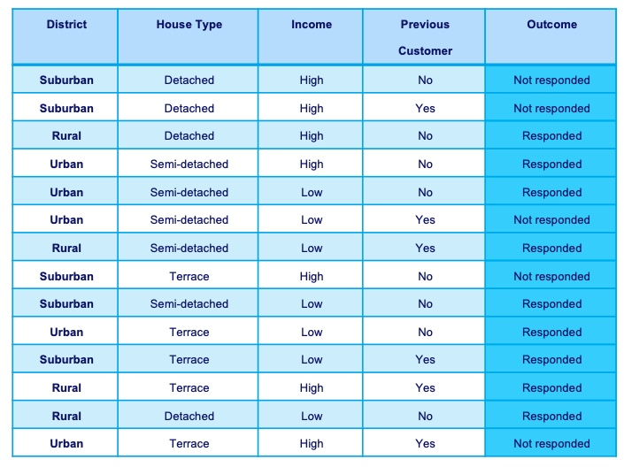

*(Last updated: 17. April. 2020)*

This blog post is a supplement for Data Mining instruction at *Business Process Intelligence, RWTH-Aachen*.

### Concept
Decision trees can be categorized into the classification tree where the target values are discrete and the regression tree where target values are continuous. In the remainder, we are going to focus on classification trees. In this type of decision tree, leaves represent class labels and branches represent conjunctions of features that lead to those class labels.

The essential is to find the non-leaf nodes in the decision tree (i.e., features composing the branches), which best represent the data. However, we cannot enumerate all possible decision trees since there is an exponential number of them.

Thus, we need a good algorithm that can efficiently find good decision trees. A well-known approach (ID3 algorithm) takes a greedy approach. It first starts with a tree having only a root node and incrementally expand it by adding decisive non-leaf nodes (i.e., features). Now the question is how we can evaluate if a feature is decisive or not. Here comes the concept of Entropy. Entropy $E$ measures the disorder of any set.

$E=-\Sigma_{i=1}^{k}p_i log_2(p_i)$, where $k$ is possible values enumerated, $p_i=c_i/n$ is the fraction of elements having value $i$ with $c_i \ge 1$ the number of $i$ values and $n=\Sigma_{i=1}^k c_i$.

The higher the value is, the lower the disorder in the set is. This approach selects a feature greedily with low Entropy at a given time.

### Decision Tree Exercise
As an exercise, let's calculate the Entropy of $[a,a,a,a,b,b,c,d]$. Let $c$ be the number of each element. Then, $c_a=4, c_b=2, c_c=1, c_d=1$, while the total number of elements is $8$ (i.e., $n=8$). We can calculate the probability as follows: $p_a=4/8, p_b=2/8, p_c=1/8,$ and $p_d=1/8$. Finally, we can calculate the Entropy with the equation of the above equation. As you can see, the probability part (i.e., $p_i$) increases as it gets larger, while the log probability part decreases as it gets larger. It makes sense since any dominant element should have a less positive contribution to Entropy. So does the infrequent element. The former is achieved with a small log probability value, and the latter is achieved by a small probability value.
Let's try a more realistic example below.

Suppose that _Outcome_ is our response variable. Let's compute the information gain obtained by splitting this dataset using _District_ attribute (i.e., $E_{Total}-E_{District}$)
Let's first calculate the Entropy for the whole dataset, $E_{Total}$. The numbers of _responded_ and _not responded_ are $9$ and $5$, respectively. The Entropy is calculated as $0.94029$. Then, let's see what happens after we split the samples based on _District_. For _Suburban_, there are $2$ and $3$ numbers of _responded_ and _not responded_. For _Rural_, there are $4$ numbers of _responded_. For _Urban_, there are $3$ and $2$ numbers of _responded_ and _not responded_. We can calculate the Entropy for each subset. Finally, we calculate the weighted average of the entropy values, and subtract it from the initial Entropy, resulting in $0.24675$.
You can do the same for other attributes and the results are as follows: $E_{Total}-E_{House-Type}=0.04998$, $E_{Total}-E_{Income}=0.15184$, and $E_{Total}-E_{Previous-Customer}=0.04813$. Which attribute should you choose for the first split of the decision tree? Yes, _District_!