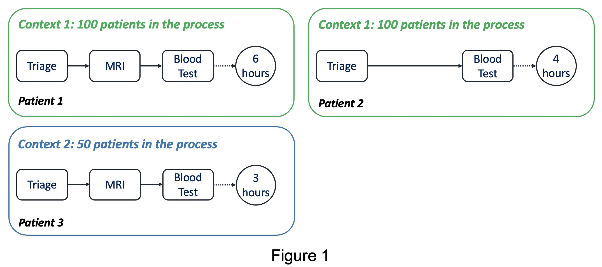
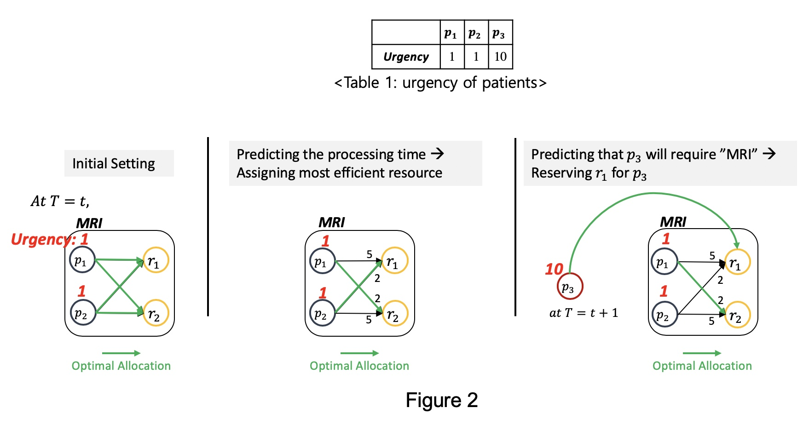
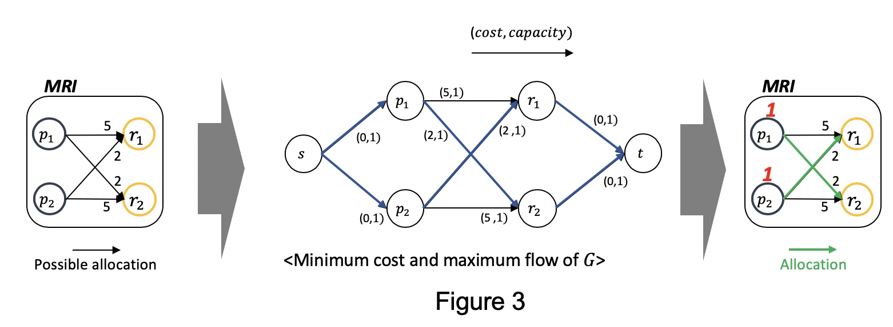

*(This post is also uploaded at [PADS blog](https://blog.rwth-aachen.de/pads/))*.

Process mining has provided effective techniques to extract in-depth insights into business processes such as process discovery, conformance checking, and enhancement. Nowadays, with the increasing availability of real-time data and sufficient computing power, practitioners are more interested **in _forward looking_ techniques whose insights can be used to improve performances and mitigate risks of running process instances**.

Research on these _forward looking_ techniques has been actively done in the field of process mining. _Predictive business process monitoring_ is one of those approaches, whose aim is to improve business processes **by offering timely information** (e.g., remaining time of running instances) that enables proactive and corrective actions.

However, these techniques do not suggest how the predictions are exploited to improve business processes, leaving it up to the subjective judgment of practitioners. The transformation from predictions to concrete actions remain as **missing link to achieve the goal of process improvement**.

A recent paper, ["_Prediction-based Resource Allocation using LSTM and Minimum Cost and Maximum Flow Algorithm_"](https://ieeexplore.ieee.org/document/8786063), demonstrate an effort to connect the missing link between the predictive insights to concrete recommendations, which enables process improvement. In the paper, authors exploit the **prediction results from predictive business process monitoring techniques to recommend optimal resource allocations in business processes**.

In the following, I will explain 1) Predictive business process monitoring, 2) Resource allocation in business process, and 3) Prediction-based recommendation (specifically for resource allocation)

### 1. Predictive business process monitoring

Predictive business process monitoring techniques provide insightful predictions on running instances in business processes. The techniques can be divided into several categories depending on the type of values they aim to predict. The primary types of predictions include

- remaining time (i.e., how much time is left to complete a case),
- risk probability (i.e., how probable it is for a case to fail at the end),
- next event (i.e., the property of the next event (e.g., next activity) of a case).

How can we predict those values? There exist several different approaches, but in a simple way, we can think of them as **finding a correlation between features (i.e., _predictors_) and the target values (i.e., _predictand_)**.

There are mainly two types of _predictors_ that can be used to describe _predictand_. The first type is the _case property_, which indicates the case attributes (e.g., the membership of a customer) or the event attributes that are related to the case (e.g., the previous treatments a customer went through in the process). The second type is the _context of a business process_, which describes the status of the process at the time predictions are made (e.g., the total number of ongoing cases in the process and the total number of resources in the process, etc.).

Let's have a look at the example showing how we derive the correlation between _predictors_ and _predictand_.

Assume that we are interested in building a model to find the correlation between the **activity records that a patient went through in the past (_predictor-case property_) and the number of ongoing patients in the process (_predictor-context of a business process_)** and **the remaining time (_predictand_)**. In _context1_ with 100 ongoing patients, _Patient1_ went through _Triage_, _MRI_, _Blood Test_ in the past, and the remaining time was 6 hours. On the other hand, _Patient2_ was in the same context as _Patient1_ while skipping _MRI_ compared to _Patient1_, and the remaining time was 4 hours. From these observations, we are able to find that the existence of an MRI operation is **positively correlated** to the remaining time (possibly due to the following additional operations like MRI evaluation, etc.).

_Patient3_ was in _context2_ with 50 ongoing patients and went through the same activities as _Patient1_, but the remaining time was 3 hours. Based on this, we can conclude that the number of ongoing patients in the process is **negatively correlated** to the remaining time. The discovered correlations can be used to predict the remaining times of any given running instances with its values of _predictors_.

### 2. Resource allocation in business process

Resource allocation is to **allocate appropriate resources to tasks at the correct time**, which enables to improve productivity, balance resource usage, and reduce execution costs. Resource allocation in business process management shares commonalities with the Job Shop Scheduling Problem (JSSP). JSSP is to find the job sequences on machines to achieve a goal (e.g., minimizing makespans), while the machine sequence of the jobs is fixed.

A huge amount of approaches has been suggested to solve JSSP in the field of operations research. One of the promising approaches is _dispatching rules_ due to its computing efficiency and robustness to uncertainty.

However, **those techniques require parameters** such as the release time, the processing time, and the sequence of operations of jobs. Indeed, in many cases of business processes, we have limited information that prohibits the deployment of them. For instance, in an emergency department of a hospital, we do not know when and why a patient would come into the department before the visit happens, clinical procedures of the patient, and the processing time taken for resources to finish an operation.

### 3. Prediction-based resourcea allocation

You may expect what comes next. Yes, we can exploit the techniques from predictive business process monitoring to deal with resource allocation in business processes where required parameters for scheduling are missing. **To this end, first, we predict the relevant parameters (e.g., the subsequent activities of the patients and their processing times) and then utilize them to optimize resource allocation**.

Suppose we optimize the resource allocation at time $t$ in MRI operation, as shown in Figure 2, with respect to the total weighted completion time. Note that we use the urgency of patients, described in Table 1., as weights. The higher the urgency of a patient is, the more weight he/she is assigned to. In other words, we want to assign resources to patients in a way that minimizes the processing time, and, at the same time, treat urgent patients earlier than others.

Let's first consider the initial setting where we don't have any information for resource allocation. In this case, there is no option but to randomly assign patients to resources. Next, suppose we have the information about processing time required for resources to treat different patients. In this case, we can assign the most efficient resource to each patient, i.e., $p_{1}$ to $r_2$ and $p_2$ to $r_1$. Finally, assume that we predict that an urgent patient, $p_3$, is about to require MRI operation at time $t+1$. In this case, we can reserve a resource to wait for this patient since it is more efficient in terms of total weighted completion time, i.e., at $t$, $p_1$ to $r_2$ and at $t+1$, $p_3$ to $r_1$. **To sum up, if we predict the processing time and the next activity of a patient, we can tremendously improve the scheduling performance.**

Then, how can we solve it in an algorithmic way? For this, we formulate the resource allocation problem into _minimum cost and maximum flow problem_, where we aim at maximizing the number of flows while minimizing the cost of flows. This problem is solved in **polynomial time** by _network simplex method_, so the algorithm for resource allocation is.

Figure 3 shows how we formulate it. Based on the parameters we predicted (the leftmost), we add source node $s$ and sink node $t$. Besides, we annotate $(cost,capacity)$ on each arc. The arcs coming from source node and to source node always has $(0,1)$, while $cost$ of other arcs are designed to be proportional to the processing time. By applying _network simplex method_ in this graph, we get the optimal resource allocations as depicted as green arcs in the rightmost.

### For more information,

Check out [slides of ICPM 2019](https://icpmconference.org/2019/wp-content/uploads/sites/6/2019/09/ICPM-20190626-gnpark_f.pdf)

1. G. Park and M. Song, ["_Prediction-based Resource Allocation using LSTM and Minimum Cost and Maximum Flow Algorithm_"](https://ieeexplore.ieee.org/document/8786063), 2019 International Conference on Process Mining (ICPM), Aachen, Germany, 2019, pp. 121-128.