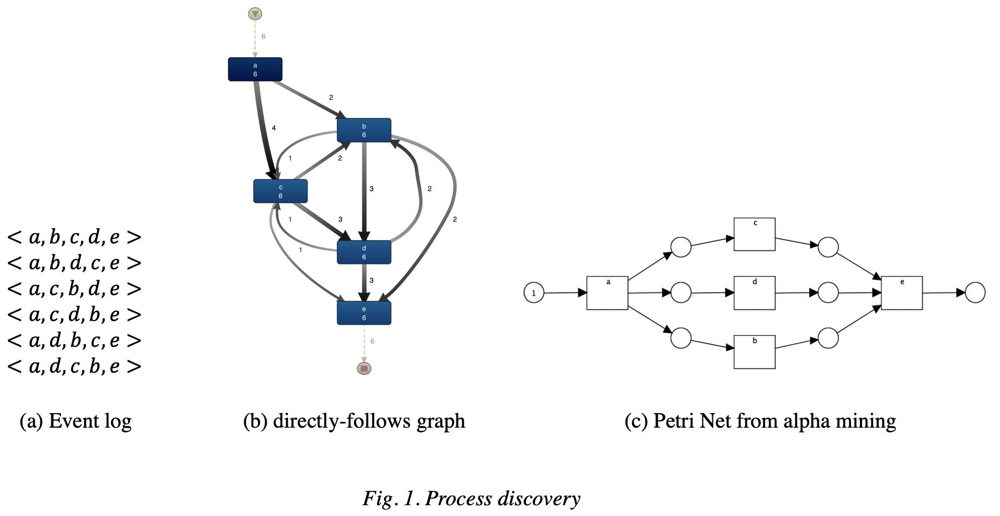

_(Last updated: 18:00 1. Apr. 2020)_

**Process mining** has been provided effective tools to improve inefficiencies residing in organizational processes. In process mining, **data-driven** approaches are used to improve the organizational processes with **process-centric** viewpoint.

**Process discovery** is at the heart of process mining. Process discovery techniques enable practitioners to find process models using event logs that are recorded at process-aware information systems. The resulting process model shows **a comprehensive view of the processes** that organizations have. It helps business owners to have the unprejudiced, objective understanding of their processes and further identify problems which cause inefficiencies.

(One might think that the process model already exists in the organization. Indeed, the process model is not explicit information. The normative process model is usually not reflecting reality.)

Let's think of it with respect to our daily life. We know we have many kinds of behavioral frictions in our daily activities (e.g., due to our own laziness, unexpected meeting, etc.). Suppose we want to improve our daily routine to increase our productivity. The first thing we need to understand is how we actually behave. Given the logs of our daily life, the process discovery techniques enable us to discover the process model describing our daily routine. Based on it, we can identify the inefficiencies and come up with measures to improve them. We may expect that our daily routine follows our desired plan, but instead, it is highly likely that the reality is quite different from our expectations.

Now, we understand why we need process discovery. Then how? A possible way to understand the execution of processes is by using _sequence mining_. Using techniques for sequence mining, we can discover frequently occurring patterns in the traces. For example, we can find a frequently occurring sequence like, "Place order" $\to$ "Send invoice" $\to$ "Receive payment", in the order handling process. However, it is limited in that it provides the local patterns in the process. We still need a comprehensive view of the process to have a better understanding of how it really works.

An alternative approach to have this overall view is to use _a directly-follows graph (DFG)_. It shows the overall relations among activities. However, it has difficulties in capturing **_concurrency_**. Why does _concurrency_ matter? Let's have a look at the example shown in Fig. 1. Fig. 1-b is a DFG discovered from traces in Fig. 1-a. It looks like there is a loop between b and d. If we have a look into the traces, all instances start with activity _a_  and end with activity _e_, while activities _b,c,d_ are executed in any order (i.e., there are concurrent executions of them).

Alpha algorithm solved this concurrency problem with just 8 lines of an algorithm. By deploying Petri Nets to represent the process, it is able to generate the desired process model, as shown in Fig 1-(c), from the event log. This is a novel approach to discover **comprehensive process models that consider concurrencies** existing in the underlying processes. All we need to do is to feed it proper event logs. However, as most of the proposed process discovery algorithms do, this algorithm has _local_ (algorithm-specific) problems as follows:

  - The resulting model contains implicit places, which means the redundant places whose existences do not limit the possible traces from a Petri Net.
  - The resulting model does not need to be a sound WF-net, which means it sometimes has deadlock and livelocks.
  - The resulting model cannot handle short loops.
  - Most processes have complex dependencies in the execution of activities. However, it finds the local dependencies (e.g., direct causal dependency), while having difficulties in discovering non-local dependencies.

Various refinements have been proposed to handle these _local_ problems, and, fortunately, most of the problems mentioned above are somehow solved. Does this mean that we now are all right? The answer is **No**. First, the refined algorithms have other types of their own _local_ problems. There is no single algorithm that is free from any limitations. Second, more importantly, there are also **_global_ (algorithm-agnostic) problems** that any discovery algorithms encounter.

What are those _global_ problems? Let's have a look at them one by one.

  - First, we cannot easily guarantee that the event log we use for the process discovery is complete. An event log is the record of already executed operations in the process. No one knows which traces are possible more.
  - Second, there is overfitting and underfitting issues. As mentioned as the first _global_ problem, the event log we have is not complete. In this case, it is not desired to have a model that can replay all the possible traces defined in the event log (i.e., overfitted model). The model will not cover the unknown traces that do not exist in the log, even though they are possible. Thus, we need the models that are generalized well for the unknown (i.e., underfitted model). We need a balance between overfitting and underfitting. (How to generalize model?)
  - Let's assume that we have a complete event log to make our lives easier. In this case, we can find a perfect process model that can represent the underlying process. However, we still have overfitting and underfitting issues. Suppose there is a model _A_, which can replay all the traces in the log, and model _B_, which can replay 98% of the traces. It looks obvious that model _A_ is a better model, but what if model _A_ is incredibly complicated than model _B_. In some situations, we need to choose model _B_ instead of _A_. (But, note that more complicated models are necessarily more accurate than less complicated models (e.g., flower model is simple, but allows many traces).
  - Third, the behaviors defined by the discovered process model depends on the properties of the modeling notation. We call it **representational bias**. For example, any algorithms using DFG cannot model concurrencies because DFG cannot express concurrencies in it. Likewise, Petri nets used by the alpha algorithm have another representational bias. For example, it cannot model transitions with the same labels (i.e., duplicate activities). Furthermore, most of the modeling notations that are frequently used have limitations to handle complex control-flow constructs such as cancelation, unbalanced splits and joins, partial synchronization, etc.

Now, you understand how difficult it is to discover "optimal" process models. Actually, there is **no single agreement on the definition of "optimal" process models**. It highly depends on the intended purpose. It is just like there is no single neural network (or any other prediction model) that is optimal to solve a problem. **Therefore, it is essential to have discovery algorithms that can be tuned to specific applications.** To that end, efforts only from the research area are not sufficient. It is imperative for practitioners who have a better understanding of the underlying process to get involved in the "process" of discovering process models.